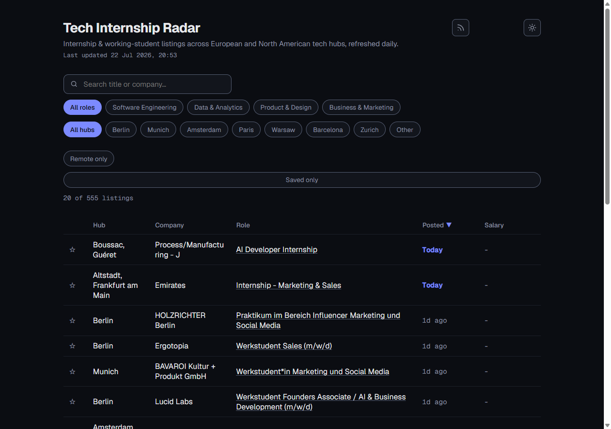

# Tech Internship Radar

[](https://github.com/handcraftedbygod/tech-internship-radar/actions/workflows/ci.yml)
[](LICENSE)

**A daily-refreshing tracker of internship & working-student listings** across European and North
American tech hubs — Berlin, Munich, Amsterdam, Dublin, London, Paris, Stockholm, Helsinki,
Tallinn, Warsaw, Barcelona, Lisbon, Zurich, New York, San Francisco, Seattle, Austin, Toronto, and
Vancouver.

### 🔗 [**View the live site → handcraftedbygod.github.io/tech-internship-radar**](https://handcraftedbygod.github.io/tech-internship-radar/)

No sign-up, nothing to install — the current listings are already there, refreshed automatically
every day.



## Features

- **Freshness, salary & hiring-cycle signals** — "Today"/"Nd ago" badges, a salary column where a
  source reports one, and hiring-cycle tags (e.g. "Summer 2027") auto-detected straight from job
  titles — no manual curation.
- **Bookmarks & "new since last visit"** — save listings and see what's landed since you last
  checked, both local to your browser via `localStorage` (no login, no backend).
- **RSS feed** — subscribe to `feed.xml` instead of checking the page.
- **Config over code** — hubs, keywords, and companies all live in `config/` and are data changes,
  not rewrites. See [Configuring](#configuring-no-code-changes) below.
- Data comes only from public, ToS-friendly sources: Greenhouse/Lever/Ashby/Workday's public job
  board APIs for a curated company list, plus the Adzuna, Arbeitnow, and Remotive job APIs.

## How it works

```
fetchers/  →  pipeline/filter.ts  →  pipeline/dedupe.ts  →  pipeline/store.ts  →  pipeline/export.ts
(one file    (keyword + location     (collapse by id)      (SQLite upsert)       (SQLite → jobs.json,
per source)   + recency + season,                                                 meta.json, feed.xml)
              all from config/)
```

`pipeline/run.ts` runs all of the above in order and writes `pipeline-summary.md` (also appended
to the GitHub Actions job summary in CI). Each fetcher never throws — a dead or failing source
reports an error but returns whatever jobs it did get, so one bad source can't break the run.

## Configuring (no code changes needed)

- **Keywords** — `config/keywords.json`. Case-insensitive, whole-word, **title-only** matching
  (scanning descriptions causes false positives from ATS benefits boilerplate).
- **Hubs & remote eligibility** — `config/locations.json`. Toggle `allowRemoteGlobal` to
  include/exclude remote-eligible listings.
- **Companies polled via ATS APIs** — `config/companies.json`. See "Adding a company" below.
- **Max listing age** — `config/settings.json` → `maxAgeDays` (default 7).

## Adding a company

Add one entry to `config/companies.json`:

```jsonc
{ "name": "Example Co", "source": "greenhouse", "boardToken": "examplecoslug" }
{ "name": "Example Co", "source": "lever", "company": "examplecoslug" }
{ "name": "Example Co", "source": "ashby", "companyName": "examplecoslug" }
{ "name": "Example Co", "source": "workday", "endpointUrl": "https://<tenant>.wdN.myworkdayjobs.com/wday/cxs/<tenant>/<site>/jobs" }
```

The list is curated, **not live-verified** — a wrong slug just makes that one company 404 for a
run (visible in `pipeline-summary.md`), it won't break anything else.

## Adding a new source

Add one file to `fetchers/` that default-exports a function matching the `Fetcher` type in
`fetchers/types.ts`, then register it in `fetchers/index.ts`. It must catch its own errors.

## Running locally

```bash
npm ci
cp .env.example .env   # fill in ADZUNA_APP_ID / ADZUNA_APP_KEY (https://developer.adzuna.com/)
npm run pipeline       # fetch → filter → dedupe → store → export
npx serve web          # or: python -m http.server --directory web
```

Other scripts: `npm test`, `npm run typecheck`.

## Deployment

Two GitHub Actions workflows: `pipeline.yml` (daily at 04:00 UTC, commits refreshed data to
`main`) and `pages.yml` (deploys `web/` to GitHub Pages on every push to `main`). Repo secrets
`ADZUNA_APP_ID`/`ADZUNA_APP_KEY` enable the Adzuna fetcher; other sources work without them.

## Contributing

See [CONTRIBUTING.md](CONTRIBUTING.md) — most useful contributions are one-line config changes
(a hub, a keyword, a company slug), not code.

## License

[MIT](LICENSE)
