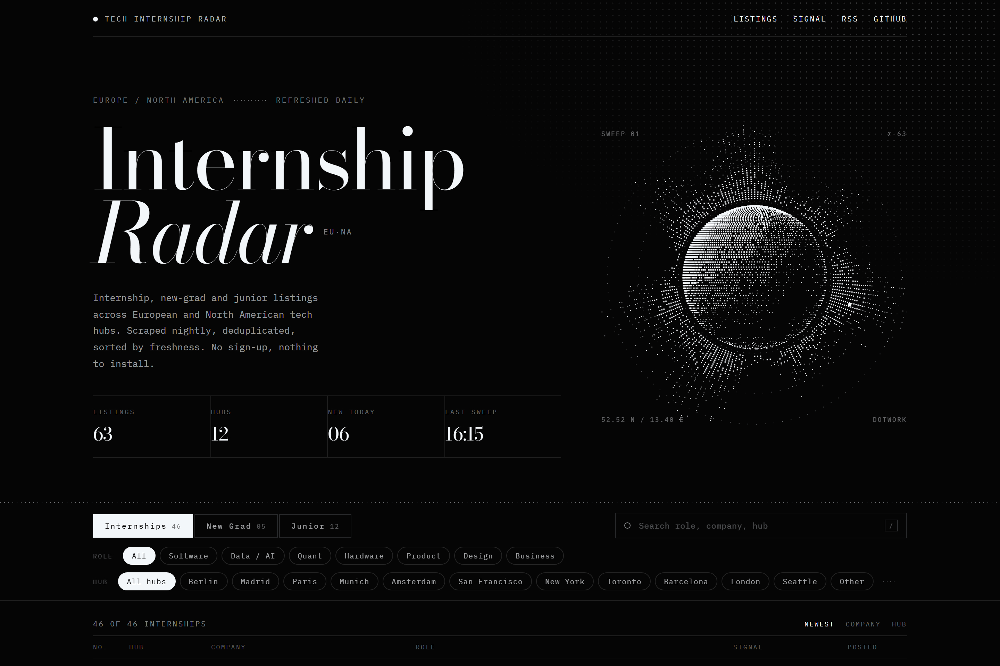
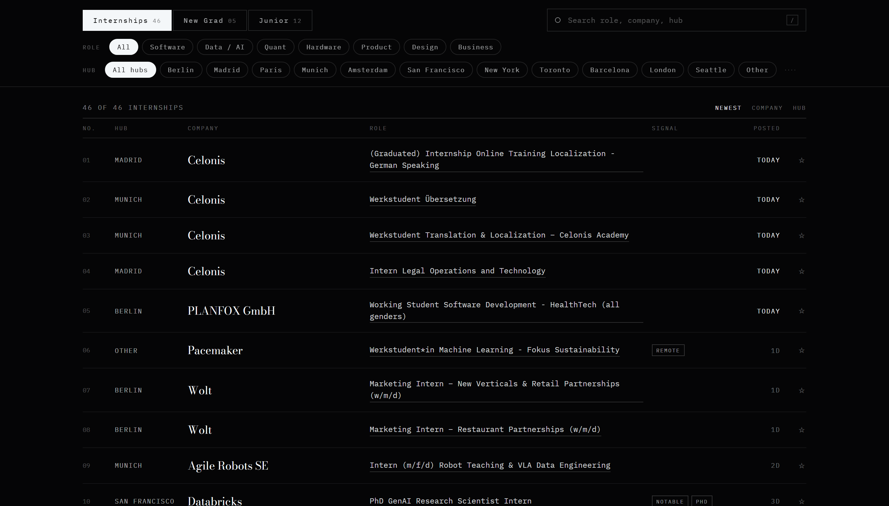

# Tech Internship Radar

[](https://github.com/handcraftedbygod/tech-internship-radar/actions/workflows/ci.yml)
[](https://handcraftedbygod.github.io/tech-internship-radar/)
[](LICENSE)
[](https://github.com/handcraftedbygod/tech-internship-radar/stargazers)

**The tab you check before Simplify/LinkedIn, not instead of them.** Every internship,
new-grad, and junior tech listing across European and North American hubs, scraped nightly,
deduplicated, and sorted by freshness — so you see what's new the moment it's posted, not
three days and 400 applicants later.

No sign-up. No account. No inbox full of "recommended for you" noise. Open the page,
see today's listings, apply, close the tab.

**[→ Open the live radar](https://handcraftedbygod.github.io/tech-internship-radar/)**

<p align="center">
  
</p>

## Why this exists

Internship hunting is a speed game. The best roles at the companies everyone wants — Stripe,
Databricks, Anthropic, Figma — routinely close applications within days of opening, sometimes
hours. By the time a listing shows up in a weekly newsletter or a spreadsheet someone forgot
to update, it's gone.

Tech Internship Radar closes that gap:

- **Nightly sweeps, not weekly digests.** The pipeline runs every night. `NEW TODAY` on the
  hero means exactly that — first-seen in the last 24 hours.
- **Signal, not spreadsheets.** `FAANG`/`NOTABLE` flags competitive companies, `EARLY` flags listings
  for a hiring cycle beyond the current year (the ones almost nobody applies to yet because
  they haven't noticed), `PHD` flags advanced-degree requirements — all auto-detected from the
  title, zero manual curation lag.
- **One page, three tracks.** Internship, new-grad, and junior listings live side by side —
  switch with one click instead of bookmarking three different sites.
- **Pay, even when nobody publishes it.** Almost no listing states a salary. Each row still gets
  an estimated hourly band, modelled from the hub, company tier, level and discipline — so you can
  sort by `EST. PAY` and see what a role is actually worth before you spend an evening on it.
- **It's actually fast.** No account, no onboarding flow, no cookie banner. Static HTML, sub-second
  load, works with JavaScript disabled turned into "please turn it back on" and nothing else.

## What it looks like

<p align="center">
  
</p>

## Features

- **Internships, New Grad, and Junior in one place.** A single toggle switches the whole view.
- Freshness badges, hiring-cycle tags (e.g. "Summer 2027" flagged `EARLY`), company-tier
  (`FAANG` for elite names, `NOTABLE` otherwise) and advanced-degree (`PHD`) badges — all
  auto-detected from job titles, no manual tagging.
- Bookmarks (`★`) and per-listing freshness, stored locally. No login, no backend, no tracking.
- RSS feed (`feed.xml`) if you'd rather it come to you.
- Every hub, keyword, and company lives in `config/`, so growing coverage is a data change,
  not a code change — see [Contributing](#contributing) below.
- Sources: Greenhouse, Lever, Ashby, Workday, SmartRecruiters, and Recruitee's public job board
  APIs for a curated company list, plus the Adzuna, Arbeitnow, Remotive, and The Muse job APIs.

## How it works

```
fetchers/  →  pipeline/filter.ts  →  pipeline/dedupe.ts  →  pipeline/store.ts  →  pipeline/export.ts
(one file      (keyword + location      (collapse by id)      (SQLite upsert)       (SQLite → jobs.json,
per source)     + recency + season,                                                  meta.json, feed.xml)
                all from config/)
```

Each fetcher never throws. A dead or failing source reports an error but returns whatever jobs
it did get, so one bad source can't break the run.

## Configuring

- **Keywords**: `config/keywords.json` (title-only matching, to avoid ATS boilerplate false positives)
- **Hubs & remote eligibility**: `config/locations.json`
- **Companies**: `config/companies.json`
  ```jsonc
  { "name": "Example Co", "source": "greenhouse", "boardToken": "examplecoslug" }
  { "name": "Example Co", "source": "lever", "company": "examplecoslug" }
  { "name": "Example Co", "source": "ashby", "companyName": "examplecoslug" }
  { "name": "Example Co", "source": "workday", "endpointUrl": "https://<tenant>.wdN.myworkdayjobs.com/wday/cxs/<tenant>/<site>/jobs" }
  { "name": "Example Co", "source": "smartrecruiters", "companyIdentifier": "examplecoslug" }
  { "name": "Example Co", "source": "recruitee", "subdomain": "examplecoslug" }
  ```
  A wrong slug just 404s that one company for a run (visible in `pipeline-summary.md`). Note
  SmartRecruiters and Recruitee postings still pass through the tech-gate keyword filter (see
  `config/keywords.json`) since their typical customer is a large mixed-workforce employer, not a
  pure tech company — unlike Greenhouse/Lever/Ashby/Workday boards, which skip that gate.
- **Max listing age**: `config/settings.json` → `maxAgeDays` (default 7)

## Running locally

```bash
npm ci
cp .env.example .env   # optionally fill in ADZUNA_APP_ID / ADZUNA_APP_KEY
npm run pipeline       # fetch → filter → dedupe → store → export
npx serve web
```

`npm test` / `npm run typecheck` for the rest.

## Contributing

Missing your target company, or a hub that isn't covered yet? Adding one is a one-line PR to
`config/companies.json` or `config/locations.json` — no code required. If your company has a
Greenhouse, Lever, Ashby, Workday, SmartRecruiters, or Recruitee board, it can be in the next
nightly sweep.

If this saved you from missing a deadline — or just means one less tab to check — **starring
the repo is the easiest way to help it reach the next person scrambling through job boards at
midnight.** It also means you'll actually see it again the next time GitHub reminds you what
you starred, instead of losing the link in a sea of browser tabs.

## License

[MIT](LICENSE)
