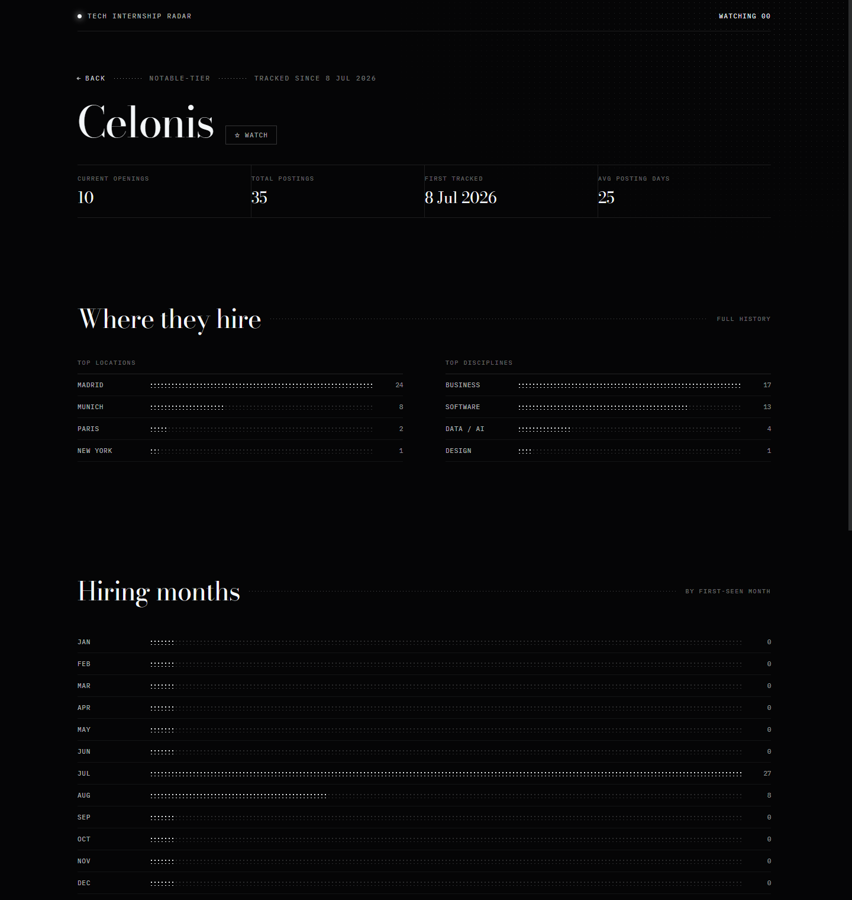
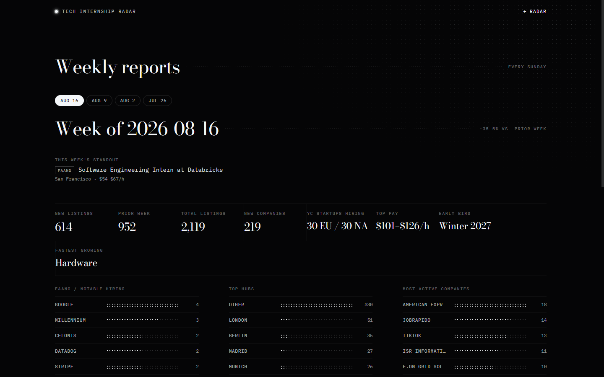

# Tech Internship Radar 📡

[](https://github.com/handcraftedbygod/tech-internship-radar/actions/workflows/ci.yml)
[](https://handcraftedbygod.github.io/tech-internship-radar/)
[](LICENSE)
[](https://github.com/handcraftedbygod/tech-internship-radar/stargazers)

**The tab you check before Simplify/LinkedIn, not instead of them.** Every internship,
new-grad, and junior tech listing across European and North American hubs, scraped nightly,
deduplicated, and sorted by freshness, so you see what's new the moment it's posted, not
three days and 400 applicants later.

No sign-up. No account. No inbox full of "recommended for you" noise. Open the page,
see today's listings, apply, close the tab.

**[👉 Open the live radar](https://handcraftedbygod.github.io/tech-internship-radar/)**

<p align="center">
  
</p>

## What makes this different ✨

- 🌙 Nightly hiring intelligence, not a weekly digest
- 👀 Watch a company and get pinged the moment they post, no polling, no email lag
- 🏢 Full hiring history for every tracked company, one click away
- 💸 Pay estimates even when the listing doesn't publish one
- 🌱 Early hiring seasons flagged before anyone else notices them
- 📦 A "Missed It" archive for closed roles at top-tier companies, instead of just deleting them
- ⚡ No account, no tracking, no framework - just a fast static page

## Why this exists 🎯

Internship hunting is a speed game. The best roles at the companies everyone wants (Stripe,
Databricks, Anthropic, Figma) routinely close within days of opening, sometimes hours. By the
time a listing shows up in a weekly newsletter or a spreadsheet someone forgot to update, it's
gone.

Tech Internship Radar closes that gap:

- **Nightly sweeps, not weekly digests.** The pipeline runs every night, so `NEW TODAY` on the
  hero means exactly that: first seen in the last 24 hours.
- **Signal, not spreadsheets.** `FAANG`/`NOTABLE` flags competitive companies, `EARLY` flags
  listings for a hiring cycle beyond the current year (the ones almost nobody applies to yet
  because they haven't noticed), and `PHD` flags advanced-degree requirements. All of it is
  auto-detected from the title, with zero manual curation lag.
- **One page, three tracks.** Internship, new-grad, and junior listings live side by side.
  Switch with one click instead of bookmarking three different sites.
- **Pay, even when nobody publishes it.** Almost no listing states a salary, so each row gets
  an estimated hourly band modelled from the hub, company tier, level, and discipline. Sort by
  `EST. PAY` and see what a role is actually worth before you spend an evening on it.
- **It's actually fast.** No account, no onboarding flow, no cookie banner. Static HTML,
  sub-second load, and "please turn JavaScript back on" is the only thing it'll ever ask of you.

## What it looks like 📸

<p align="center">
  
</p>

Watch a company and its full hiring history is one click away:

<p align="center">
  
</p>

A weekly market snapshot, generated straight from the pipeline, every Sunday:

<p align="center">
  
</p>

## Features

- **Internships, New Grad, and Junior in one place.** A single toggle switches the whole view.
- Freshness badges, hiring-cycle tags (e.g. "Summer 2027" flagged `EARLY`), company-tier badges
  (`FAANG` for elite names, `NOTABLE` otherwise), and advanced-degree badges (`PHD`), all
  auto-detected from job titles with no manual tagging.
- Bookmarks (`★`) and per-listing freshness, stored locally. No login, no backend, no tracking.
- RSS feed (`feed.xml`) if you'd rather it come to you.
- **YC startups hiring**, Europe-tagged and newest-launched first, sourced from the
  [yc-oss/api](https://github.com/yc-oss/api) mirror of YC's company directory. It's a company
  directory rather than job listings (YC doesn't expose per-role posting data publicly), so each
  row links out to the company's YC page instead of an apply URL.
- **Company pages.** Every tracked company gets its own page: tier, hub, tracked-since date, and
  its full posting history in one place.
- **Watchlist.** Watch a company from its page and a banner tells you the moment it posts
  something new. Stored on your device, no account, no email.
- **Weekly reports**, every Sunday: new-listing counts, week-over-week change, the hottest hubs
  and companies, and the fastest-growing discipline.
- Every hub, keyword, and company lives in `config/`, so growing coverage is a data change, not
  a code change. See [Contributing](#contributing) below.
- Sources: Greenhouse, Lever, Ashby, Workday, SmartRecruiters, and Recruitee's public job board
  APIs for a curated company list, plus Adzuna, Arbeitnow, Remotive, The Muse, EURES (the EU's
  official cross-border job portal), Remote OK, USAJOBS (US federal Pathways internships and
  Recent Graduates postings), and the community-maintained
  [vanshb03/Summer-Internships](https://github.com/vanshb03/Summer2027-Internships) and
  [New-Grad](https://github.com/vanshb03/New-Grad-2027) listings for US/Canada coverage.

## How it works 🔧

```
fetchers/  →  pipeline/filter.ts  →  pipeline/dedupe.ts  →  pipeline/store.ts  →  pipeline/export.ts
(one file      (keyword + location      (collapse by id)      (SQLite upsert)       (SQLite → jobs.json,
per source)     + recency + season,                                                  meta.json, feed.xml)
                all from config/)
```

Each fetcher never throws. A dead or failing source reports an error but still returns whatever
jobs it did get, so one bad source can't break the run. Company pages and weekly reports are
built from that same SQLite store: no extra database, no separate service.

## Architecture at a glance 📊

- **200 companies** tracked across curated ATS boards
- **24 hubs** across Europe and North America
- **15 data sources**: ATS company boards, aggregator job APIs, an EU and a US government
  portal, and community-maintained listing repos (full list under [Features](#features))
- **Nightly automated pipeline**: GitHub Actions cron fetches, filters, dedupes, stores, and
  redeploys with zero manual steps
- **Dedup + normalization engine**: collapses duplicate postings across sources by job id before
  they ever reach the page
- **SQLite → static JSON**: the pipeline writes to a local SQLite file, then exports flat
  JSON/RSS. No database and no server at runtime.
- **Zero runtime dependencies**: no framework, no bundler; plain TypeScript run directly via
  `node --experimental-strip-types`
- **Sub-second page load**: static HTML/CSS/JS, nothing to hydrate

## Configuring 🛠️

- **Keywords**: `config/keywords.json` (title-only matching, to avoid ATS boilerplate false positives)
- **Hubs & remote eligibility**: `config/locations.json`
- **Companies**: `config/companies.json`
  ```jsonc
  { "name": "Example Co", "source": "greenhouse", "boardToken": "examplecoslug" }
  { "name": "Example Co", "source": "lever", "company": "examplecoslug" }
  { "name": "Example Co", "source": "ashby", "companyName": "examplecoslug" }
  { "name": "Example Co", "source": "workday", "endpointUrl": "https://<tenant>.wdN.myworkdayjobs.com/wday/cxs/<tenant>/<site>/jobs" }
  { "name": "Example Co", "source": "smartrecruiters", "companyIdentifier": "examplecoslug" }
  { "name": "Example Co", "source": "recruitee", "subdomain": "examplecoslug" }
  ```
  A wrong slug just 404s that one company for a run (visible in `pipeline-summary.md`). Note
  that SmartRecruiters and Recruitee postings still pass through the tech-gate keyword filter
  (see `config/keywords.json`), since their typical customer is a large mixed-workforce employer
  rather than a pure tech company. Greenhouse, Lever, Ashby, and Workday boards skip that gate.
- **Max listing age**: `config/settings.json` → `maxAgeDays` (default 7)

## Running locally 🏃

```bash
npm ci
cp .env.example .env   # optionally fill in ADZUNA_APP_ID / ADZUNA_APP_KEY
npm run pipeline       # fetch → filter → dedupe → store → export
npx serve web
```

`npm test` / `npm run typecheck` for the rest.

## Contributing

Missing your target company, or a hub that isn't covered yet? Adding one is a one-line PR to
`config/companies.json` or `config/locations.json`, no code required. If your company has a
Greenhouse, Lever, Ashby, Workday, SmartRecruiters, or Recruitee board, it can be in the next
nightly sweep.

If this saved you from missing a deadline (or just means one less tab to check), **starring the
repo is the easiest way to help it reach the next person scrambling through job boards at
midnight.** It also means you'll actually see it again the next time GitHub reminds you what
you starred, instead of losing the link in a sea of browser tabs.

## License 📄

[MIT](LICENSE)
